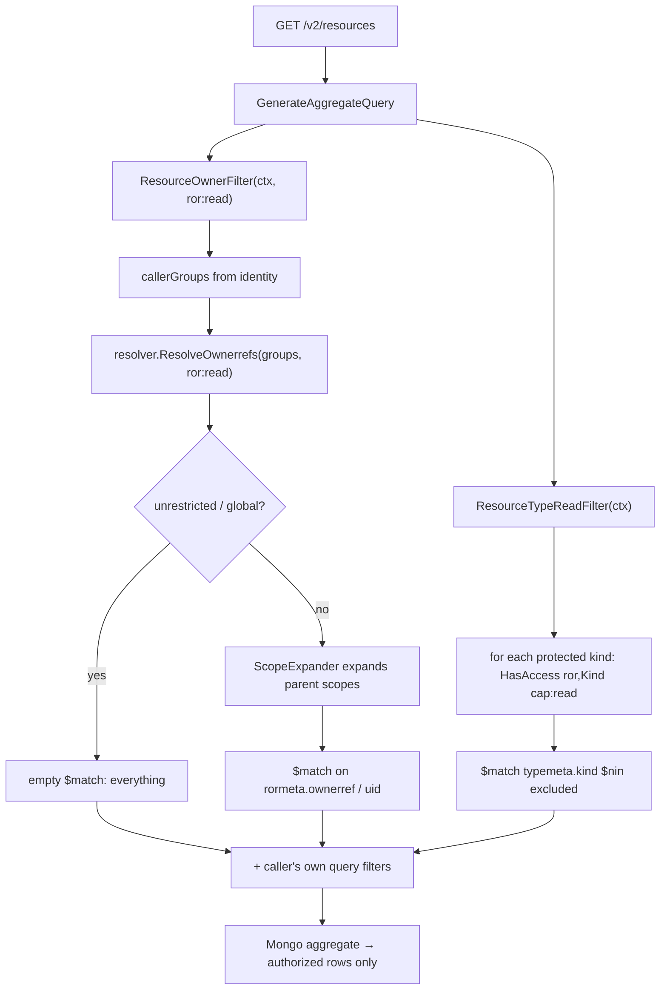

# ACL & authorization in ror-api

This document explains how authorization works in `ror-api`: the model, the
resolver, the enforcement points, and how to add access checks correctly. It is
aimed at developers changing endpoints, services, or the ACL layer itself.

> TL;DR — Every authorized action resolves the caller's **groups** → looks up
> their **ACL grants** → checks whether those grants confer the required
> **capability** on the requested **scope+subject** (optionally expanded down the
> ownership tree). You call one of a small set of `aclservice` functions; you
> almost never touch the resolver or store directly.

---

## 1. The mental model

An **ACL grant** answers: *"which group may do what, where."*

```
{ group, scope, subject, access[] }
```

- **group** — a principal name the caller belongs to (a user's IdP group, or a
  ROR-owned group for clusters/services — see §4).
- **scope** — *what kind of thing* the grant is about: the platform itself
  (`ror`), or a resource kind (`KubernetesCluster`, `Project`, `BackupJob`, …).
- **subject** — *which one*: either a **type-level** selector (e.g. `project`,
  `acl`, `globalscope`) under the `ror` scope, or an **instance** uid under a
  resource-kind scope (e.g. a specific cluster's uid).
- **access[]** — a list of **capabilities** (`AccessTypeV3`), e.g.
  `["ror:read", "ror:create", "ror:config:read"]`.

Authorization = "does any of the caller's grants match the requested
`scope+subject` and contain the required capability?" — with **scope expansion**
so a grant on a parent (e.g. a `Project`) also authorizes its descendants
(the clusters/resources it owns).

The shared model and resolver live in the `ror` module
(`github.com/NorskHelsenett/ror/pkg/...`); `ror-api` wires them up and exposes a
thin service package, `internal/acl/aclservice`, that the rest of the codebase
calls.

---

## 2. Core types

### 2.1 Scope & Subject — `pkg/models/aclmodels/aclscope`

`Scope` and `Subject` are string types. Scope values are **canonical resource
Kind names** or system scopes:

| Scope const | value | meaning |
|---|---|---|
| `ScopeRor` | `ror` | the platform; subjects are **type-level** selectors |
| `ScopeCluster` | `KubernetesCluster` | a cluster; subject = cluster uid |
| `ScopeProject` | `Project` | a project; subject = project uid |
| `ScopeDatacenter` | `Datacenter` | |
| `ScopeVirtualMachine` | `VirtualMachine` | |
| `ScopeMachine` | `Machine` | |
| `ScopeBackup` | `BackupJob` | |

A **global** grant is written as `{ror, globalscope}` (scope `ror`, subject
`globalscope`). The `all` scope/subject is a **lookup wildcard only** — it is
rejected as a grant value by `ValidateACLEntry`.

**Type-level vs instance-level subjects.** Under `ScopeRor` the subject is one of
a closed set: `globalscope`, `cluster`, `project`, `acl`, `apikey`, `datacenter`,
`workspace`, `price`, `virtualmachine`, `backup`, `database`. These name a *type*
of thing to manage. Under a resource-kind
scope the subject is an opaque **instance uid**. `Subject.HasValidScope(scope)`
enforces the closed set for `ScopeRor` and accepts any subject otherwise.

**Canonicalization.** Older ("legacy V2") scopes used lowercase names
(`cluster`, `backup`, …). `Scope.ToKind()` / `Subject.ToKind()` translate legacy
→ canonical Kind (`cluster` → `KubernetesCluster`); `ToLegacy()` is the inverse.
The pairs are defined **once** in `scopealias.go` (`legacyKindNames`). Always
store and compare **canonical** values; use `ParseScope` to accept input.

### 2.2 Capabilities & access types — `pkg/models/aclmodels/aclcaps`

An `AccessTypeV3` is a colon-delimited string `system:component[:sub]:verb`; the
**last segment is always the verb**. A `Capability` is the same string without
the verb; `cap.WithVerb(verb)` builds the access type.

```go
aclmodels.CapRor.WithVerb(aclmodels.VerbRead)      // "ror:read"
aclmodels.CapRorConfig.WithVerb(aclmodels.VerbWrite) // "ror:config:write"
```

Valid capabilities and their verbs are declared in the **`aclcaps.Registry`**
(the single source of truth). Current namespaces:

| Capability | verbs |
|---|---|
| `ror` | read, write, create, update, delete, owner |
| `ror:metadata` | write |
| `ror:vulnerability` | read, write |
| `ror:config` | read, write |
| `kubernetes` | logon, admin, readonly |
| `kubernetes:argocd`, `:argocd:project`, `:grafana` | admin |
| `virtualmachine` | delete |
| `monitoring`, `dns` | read, write |

`aclcaps.Validate(access)` (via `aclmodels.ValidateAccess`) checks a string
against the Registry. `ValidateACLEntry` validates a whole grant (scope +
access). Adding a new capability = adding a node to `Registry` (+ a `Cap*`
constant + the guard test in `aclcaps/registry_test.go`).

### 2.3 The grant model — `AclV3ListItem`

```go
type AclV3ListItem struct {
    Id       string
    Version  int            // always 3 for new writes
    Group    string
    Scope    aclscope.Scope
    Subject  aclscope.Subject
    Access   []AccessTypeV3
    Created  time.Time
    IssuedBy string
}
```

`AclV2ListItem` is the **legacy** shape (boolean `access.{read,create,update,
delete,owner}` + `kubernetes.logon`). It is used **only** as the `/v1/acl` API
DTO and for stored `version:2` documents; it is converted to/from V3 at the
boundaries (`aclmodels.V2ToV3` / `V3ToV2`). V3-only capabilities (e.g.
`ror:config:read`) have no V2 representation and are dropped by `V3ToV2`.

---

## 3. What you call: `internal/acl/aclservice`

This is the package the rest of `ror-api` uses. Two flavours of check:

### 3.1 Point check — "may this caller do X here?"

```go
allowed, err := aclservice.HasAccess(ctx, scope, subject, required)
```

`HasAccess(ctx, scope, subject, required AccessTypeV3) (bool, error)` resolves the
caller (from context) and returns true if a grant confers `required` on
`scope+subject`, **directly or via scope expansion** (an ancestor grant). Cluster
ids in `subject` are resolved to uids first (see §7).

Use this in controllers to gate an action, then return `403` when false.

### 3.2 Query filter — "which rows may this caller see?"

Instead of checking one object, produce a MongoDB `$match` that scopes a query to
the authorized set:

- `ResourceOwnerFilter(ctx, required) (bson.M, error)` — a `$match` on
  `resourcesv2` restricting to resources the caller owns (by ownerref), with
  scope expansion. Returns an empty filter for **unrestricted** (global) callers
  and a deny-all filter on error.
- `ClusterUIDFilter(ctx, required) (bson.M, error)` — a `$match` on the
  `clusters`/`datacenters`/`metrics`/… collections (keyed by top-level `uid`).
- `ResourceTypeReadFilter(ctx) (bson.M, error)` — a `$match` that **excludes
  protected resource kinds** the caller lacks the read capability for (see §6).

`ResolveOwnerrefs(ctx, required, filter) (refs []acl.Ownerref, unrestricted bool,
err error)` is the lower-level primitive behind these — it returns the
scope+subject pairs the caller is authorized for (`unrestricted == true` means
global; `refs` is empty then).

### 3.3 Grant management (CRUD)

- V3 (current, `/v2/acl`): `CreateV3`, `UpdateV3`, `DeleteV3`, `GetV3ById`,
  `GetByFilterV3` — operate on `AclV3ListItem`, preserve all capabilities.
- V1 (legacy, `/v1/acl`): `Create`, `Update`, `Delete`, `GetByFilter`,
  `GetV2ById`, `GetAllACL2` — operate on `AclV2ListItem`, converting to/from V3.

Neither the V3 nor the V1 mutation functions gate on identity **type** — the
capability check at the controller is authoritative (see §5.2).

### 3.4 Cluster helpers

- `ClusterSelfAccess() []AccessTypeV3` — the access a cluster has to its own
  resources: `[ror:read, ror:create, ror:update]`.
- `EnsureClusterSelfGrant(ctx, clusterUID)` — creates the cluster's self-grant
  (`{KubernetesCluster, <uid>}` on group `<uid>@cluster.ror.system`) if missing.
  Called at cluster registration; without it a cluster has no access at all.

### 3.5 Lifecycle / wiring

- `InitResolver(rmq)` — builds the resolver: a MongoDB store → in-memory
  **snapshot** → periodic **refresher** + RabbitMQ **change bus** + the
  **scope expander**. Call once at startup after Mongo/RabbitMQ are up.
- `Store()` — the write-through store (writes broadcast on the change bus so
  every instance refreshes).
- `SetClusterIDResolver(fn)` — injects the cluster **id→uid** lookup (ror-api
  owns DB access; see §7). Wired in `internal/apiconnections/api_connections.go`.
- `SetResolver(r)` — replaces the resolver (tests / custom sources).

---

## 4. Identity → groups

Authorization always works on **groups**, never identity type. Every identity
resolves through the same path — `identity.GetGroups()`
(`pkg/models/identity`):

| Identity type | groups |
|---|---|
| User | the IdP-supplied groups, sanitized (ROR-owned domains stripped) |
| Cluster | `aclprincipal.ClusterGroups(uid)` = `[<uid>@cluster.ror.system, *@cluster.ror.system]` |
| Service | `aclprincipal.ServiceGroups(id)` = exact + legacy + `*@service.ror.system` |

So a cluster is automatically a member of **its own** group and the
**all-clusters aggregate** `*@cluster.ror.system`; a grant on the aggregate
applies to every cluster. Principal group names are built in
`pkg/models/aclmodels/aclprincipal` (the single source of truth shared with
ror-auth).

---

## 5. Enforcement patterns

### 5.1 The subject-selector model (platform resources)

Managing a **type of platform resource** is gated by a `ror:<verb>` capability on
a **type-level subject** under the `ror` scope. Every platform resource type uses
the same shape:

```go
// may the caller create projects?
aclservice.HasAccess(ctx, aclscope.ScopeRor, aclscope.SubjectProject,
    aclmodels.CapRor.WithVerb(aclmodels.VerbCreate))

// may the caller delete ACL grants?
aclservice.HasAccess(ctx, aclscope.ScopeRor, aclscope.SubjectAcl,
    aclmodels.CapRor.WithVerb(aclmodels.VerbDelete))
```

Because `globalscope` is a resolver wildcard (see §8), a caller with a **global**
`{ror, globalscope}` grant satisfies these too — i.e. "global admins
manage all platform resources". A **narrow** grant like `{ror, acl, [ror:read]}`
grants only ACL read, without global rights.

> ACL management specifically uses `{ScopeRor, SubjectAcl, ror:<verb>}` — see
> `aclManageAllowed` in `internal/controllers/v2/aclcontroller`. There is no
> dedicated `ror:acl:*` capability by design (consistency with all other
> platform resources).

### 5.2 Where to put the check

- **Point check in the controller**, then `403`. This is the authoritative gate
  for mutations. Service functions do **not** re-check identity type.
- **Query filter in the repository/service** for list endpoints
  (`ResourceOwnerFilter` / `ClusterUIDFilter`) so the database returns only
  authorized rows.

### 5.3 No identity-type branches in enforcement

The enforcement path (`HasAccess`, `ResolveOwnerrefs`, `ResourceOwnerFilter`,
group resolution) has **no `IsCluster()`/`IsUser()` branches** — cluster/service
access is ordinary ACL **data**. Residual `IsCluster`/`IsService` uses that
remain are presentation (`/v2/self`, `/v1/clusters/self`), apikey-metadata
defaulting, and the agent-kind sync filter in `GetHashlistByQuery` — none are
authorization decisions.

---

## 6. resourcesv2 authorization (the hot path)

Reads of `resourcesv2` are authorized at query time by
`GenerateAggregateQuery` (`internal/apiservices/resourcesv2service/database.go`),
which prepends two `$match` stages before the caller's filters:



1. **Ownerref filter** — `ResourceOwnerFilter(ctx, CapRor.WithVerb(VerbRead))`:
   restrict to resources the caller owns (directly or via an expanded ancestor
   scope).
2. **Protected-kind read filter** — `ResourceTypeReadFilter(ctx)`: exclude
   resource kinds protected by a capability the caller lacks.

**Protected kinds** are declared on the resource definition:
`rordefs.ApiResource.ProtectedBy` names the capability (e.g. `Config` is
protected by `ror:config`). The read filter resolves each protected kind's
capability at its **type-level subject** `(ror, <Kind>)` — which honours both a
type-level grant (`{ror, Config}`) and a global grant — and `$nin`-excludes the
kinds without it. This applies uniformly to all identities; clusters are covered
by their ACL grant, not a code branch.

**Writes** to protected kinds are gated by `hasProtectedKindWriteAccess`
(create/update/delete): if the kind has a `ProtectedBy` capability, the caller
must hold `capability.WithVerb(VerbWrite)` on the resource's ownerref — again a
pure capability check, no identity-type branch.

---

## 7. Cluster identity: id ↔ uid

Cluster ACL entries are keyed by cluster **uid**, but callers often reference a
cluster by its human **id** (from a request path). `aclservice` normalizes id →
uid before consulting the store:

- `resolveClusterSubject` / `resolveClusterFilterSubjects` translate a cluster-id
  subject to its uid, using an injected resolver.
- The resolver is wired by ror-api (which owns DB access):
  `aclservice.SetClusterIDResolver(resolveClusterIdToUid)` in
  `api_connections.go`. `resolveClusterIdToUid` looks up the uid from the
  cluster's apikey (falling back to `resourcesv2`), cached.

This is deliberately an `aclservice`-local dependency, not a global in the shared
model package.

---

## 8. The resolver internals (reference) — `pkg/acl`

You rarely call these directly, but understanding them helps.

**`matchesScopeSubject(entry, scope, subject)`** — an entry matches a requested
`scope+subject` when any of:
- **exact**: `entry.Scope == scope && entry.Subject == subject`;
- **global**: `entry.Scope == ror && entry.Subject == globalscope` (the canonical
  global grant). A legacy `entry.Scope == all` / `entry.Subject == all` is still
  honored on read, but such grants are rejected on write (use `{ror, globalscope}`);
- **ror-scope wildcard**: `entry.Scope == ror` and (`entry.Subject == scope` or
  `entry.Subject == globalscope`).

**`Resolver.ResolveAccess(groups, scope, subject)`** → the union of access types
from all matching entries.

**`Resolver.ResolveOwnerrefs(groups, requiredAccess, filter)`** → the scope+subject
pairs the caller may act on for `requiredAccess`. Returns `nil` (meaning
**unrestricted**) when any grant is global. Non-leaf scopes (Project, Datacenter,
…) are **expanded** by the `ScopeExpander` to include descendant ownerrefs, so a
grant on a Project authorizes the clusters/resources beneath it.

**Scope expansion** — `aclstore.MongoScopeExpander` walks the `resourcesv2`
ownerref chain (`uid → rormeta.ownerref.subject`) in a single `$graphLookup`,
pruning non-owner leaves. It runs on every authorized read, so it is wrapped in a
`CachedScopeExpander` (per-seed, ~5 min) and memoizes the owner-uid set.

---

## 9. Storage — `internal/acl/aclstore` + `pkg/acl/aclstore`

Grants live in the Mongo `acl` collection. `MongoStore` (`mongostore.go`):

- **reads** documents of `version` 2 or 3 (`aclVersions = {2,3}`), converting
  `version:2` docs to canonical V3 on read (`decodeCursor` → `V2ToV3`);
- **writes** always as `version:3`.
- The V2-on-read conversion is a compatibility **shim**. Once all stored docs are
  `version:3` (migration `hacks/migrations/006_acl_v2_to_v3.js`), the shim and
  `aclVersions={2,3}` can be reduced to `{3}` — this is internal storage cleanup
  and does **not** affect the `/v1/acl` API (which converts V3↔V2 at the HTTP
  boundary regardless).

On top of the Mongo store the resolver uses an in-memory **snapshot**
(`aclstore/v2.SnapshotStore`) kept fresh by a **refresher** (periodic reload) and
a RabbitMQ **change bus** (writes on any instance refresh all instances). Writes
go through the **notifying store** (`aclservice.Store()`), which publishes the
change event.

---

## 10. The HTTP API surface

Two versions, both live:

### `/v2/acl` — V3, current
`internal/controllers/v2/aclcontroller`, routes in `webserver/routes/v2routes`:

| Method | path | purpose |
|---|---|---|
| GET | `/v2/acl/lookup` | resolve the scope+subject pairs the caller has an access type for |
| GET | `/v2/acl/lookup/:scope/:subject` | lookup by scope+subject |
| HEAD | `/v2/acl/lookup/:scope/:subject/:accesstype` | `CheckAccess` — 200 if allowed, 403 if not |
| POST | `/v2/acl` | create grant |
| POST | `/v2/acl/filter` | list grants (paginated) |
| GET | `/v2/acl/:id` | get grant |
| PUT | `/v2/acl/:id` | update grant |
| DELETE | `/v2/acl/:id` | delete grant |

All mutations/reads are gated by `aclManageAllowed(c, ctx, verb)` =
`HasAccess(ScopeRor, SubjectAcl, CapRor.WithVerb(verb))`.

### `/v1/acl` — V2, deprecated but supported
`internal/controllers/aclcontroller`, routes in `webserver/routes/v1routes`.
Same operations, speaking the V2 DTO. **Do not remove it as part of internal
cleanup** — it is a published API version, backed by V3 storage via the
`V3ToV2`/`V2ToV3` boundary conversion. Any removal follows a formal deprecation.

---

## 11. Startup wiring

`internal/apiconnections/api_connections.go`, during init:

```go
aclservice.InitResolver(RabbitMQConnection)          // store + snapshot + refresher + change bus + expander
aclservice.SetClusterIDResolver(resolveClusterIdToUid) // cluster id -> uid lookup (DB-backed)
```

Cluster registration (`apikeysservice.RegisterCluster`) calls
`aclservice.EnsureClusterSelfGrant(ctx, clusterUid)` so a freshly registered
cluster can access its own resources.

---

## 12. How-to

**Gate an endpoint on a capability**
```go
allowed, err := aclservice.HasAccess(ctx, aclscope.ScopeRor,
    aclscope.SubjectProject, aclmodels.CapRor.WithVerb(aclmodels.VerbCreate))
if err != nil { /* 500 */ }
if !allowed { /* 403 */ }
```

**Scope a list query to what the caller may see**
```go
match, err := aclservice.ResourceOwnerFilter(ctx, aclmodels.CapRor.WithVerb(aclmodels.VerbRead))
// prepend `match` (a bson.M $match stage) to your aggregate pipeline
```
For cluster-collection queries use `aclservice.ClusterUIDFilter(ctx, required)`.

**Protect a new resource kind** — set `ProtectedBy` on its `rordefs.ApiResource`
to the guarding capability. Reads are then filtered by `ResourceTypeReadFilter`
and writes gated by `hasProtectedKindWriteAccess` automatically. Grant the
capability (`<cap>:read` / `:write`) to the groups that should access it.

**Add a new capability** — add the node + verbs to `aclcaps.Registry`, add a
`Cap*` constant, and add it to the guard test in `aclcaps/registry_test.go`.

**Grant a group ACL-management** — create a grant
`{group, ror, acl, [ror:read, ror:create, ror:update, ror:delete]}` (or the
subset needed). Global `ror:<verb>` holders already qualify.

---

## 13. Invariants & gotchas

- **Store canonical scopes.** `Scope`/`Subject` values are always canonical Kind
  names; use `ParseScope` for input and `ToKind()` to normalize legacy values.
  `ValidateACLEntry` rejects non-canonical scopes on write.
- **Global grants are `{ror, globalscope}`.** `scope:"all"` / `subject:"all"` are
  rejected as grant values by `ValidateACLEntry` (both the V3 and V1 write paths);
  `all` remains only a lookup-query wildcard, and the resolver still honors any
  pre-existing `all` grants on read.
- **Authorization is capability-on-group, never identity type.** Don't add
  `IsCluster()`/`IsUser()` branches to enforcement — model the difference as a
  grant.
- **`ResourceOwnerFilter` returns an empty filter for global callers** (matches
  everything) and a **deny-all** filter on error — never a nil that silently
  matches everything by accident.
- **Scope expansion runs on every authorized read** — keep it cached; don't add
  per-request full-collection scans in the expander.
- **`/v1/acl` and stored `version:2` are independent.** The API surface is
  decoupled from the stored document version by the boundary conversion.
- **V3-only capabilities are dropped by `V3ToV2`** — a grant surfaced through
  `/v1/acl` will not show `ror:config:*` etc.

---

## 14. File map

| Area | Location |
|---|---|
| Service API (what you call) | `ror-api/internal/acl/aclservice` (`aclservice.go`, `aclv3crud.go`, `aclv2replace.go`) |
| Mongo store + V2/V3 read shim | `ror-api/internal/acl/aclstore/mongostore.go` |
| resourcesv2 query authorization | `ror-api/internal/apiservices/resourcesv2service/database.go`, `resourcesv2service.go` |
| ACL controllers | `ror-api/internal/controllers/v2/aclcontroller` (V3), `ror-api/internal/controllers/aclcontroller` (V1) |
| Startup wiring | `ror-api/internal/apiconnections/api_connections.go` |
| Model: scope/subject | `ror/pkg/models/aclmodels/aclscope` |
| Model: capabilities/registry | `ror/pkg/models/aclmodels/aclcaps` |
| Model: grant + conversion | `ror/pkg/models/aclmodels` (`aclmodelsv3.go`, `aclModelsV2.go`, `aclconvert.go`) |
| Principal group names | `ror/pkg/models/aclmodels/aclprincipal` |
| Resolver + scope expander + stores | `ror/pkg/acl`, `ror/pkg/acl/aclstore` |
| Protected-kind registry | `ror/pkg/acl/aclstore/filter.go` (`ProtectedResourceTypes`), `rordefs.ApiResource.ProtectedBy` |
